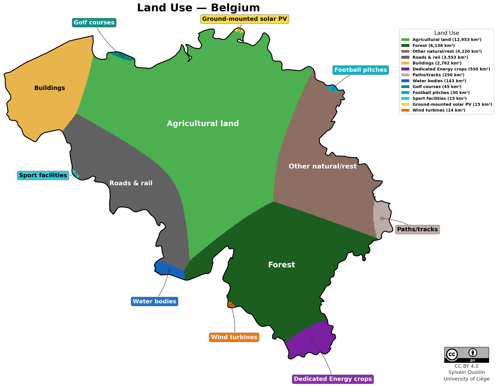
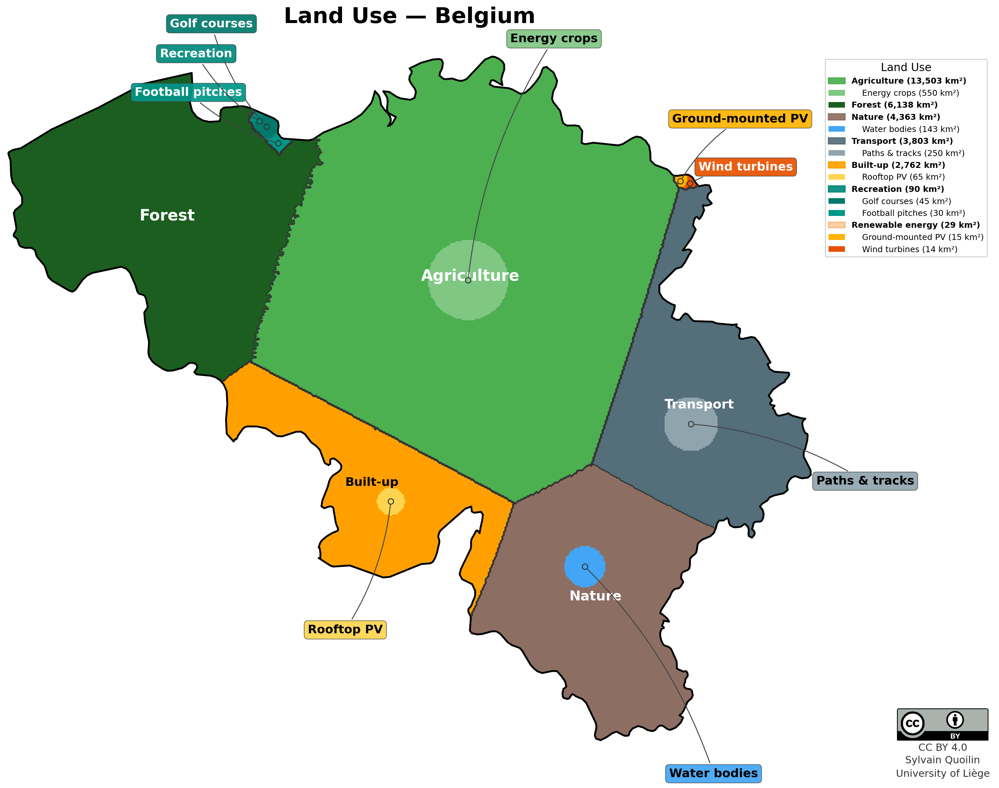

# Belgium Land Use Map

A Python tool that divides Belgium into land-use regions with predetermined
areas, producing a publication-ready map inspired by the German
"Flächennutzung Deutschland" visualisation.

The tool supports two modes:

- **Flat** — 13 independent categories, each forming one contiguous region.
- **Hierarchical** — 7 parent sectors containing 14 sub-sectors, where
  sub-sectors appear *inside* their parent on the map.

## Result

- **All categories** contiguous (single connected region each)
- **Runtime:** ~2–3 seconds

### Flat mode



### Hierarchical mode



## Quick Start

```bash
conda create -n belgium_land_use_env python=3.9 \
      geopandas shapely matplotlib numpy scipy
conda activate belgium_land_use_env

# Flat mode (13 independent categories — original behaviour)
python belgium_land_use_grid.py
# → belgium_land_use.png

# Hierarchical mode (7 parent sectors with sub-sectors)
python belgium_land_use_grid.py belgium_land_use_hierarchical.csv
# → belgium_land_use_hierarchical.png
```

The script reads a CSV file (category data) and `belgium.geojson` (country
boundary). The output filename is derived from the CSV name.

## File Structure

```
land_use_BE/
├── belgium_land_use_grid.py              # Main algorithm + visualisation
├── belgium_land_use.csv                  # Flat categories (name, area, color)
├── belgium_land_use_hierarchical.csv     # Hierarchical categories (+ parent column)
├── belgium.geojson                       # Belgium boundary (EPSG:4326)
├── belgium_boundary.geojson              # Alternative boundary
├── belgium_land_use.png                  # Generated flat-mode map
├── belgium_land_use_hierarchical.png     # Generated hierarchical-mode map
├── cc-by.png                             # CC-BY licence icon
├── germany.jpeg                          # Reference image for visual quality
├── README.md                             # This file
├── belgium_land_use_data_collection.md   # Detailed data-sourcing notes
├── .gitignore
└── legacy/                               # Previous attempts and scripts
```

## Algorithm

The approach rasterises Belgium onto a 500 m regular grid (~122 K cells in
EPSG:3035) and proceeds in five phases:

1. **Rasterise** the country boundary into a boolean mask.
2. **Seed placement** via farthest-point sampling — larger categories get more
   interior positions.
3. **Weighted Voronoi** — iteratively adjust additive weights so that each
   region converges to its target pixel count.
4. **Connectivity fix** — BFS from each seed keeps only the connected
   component; orphaned pixels are reassigned to neighbours.
5. **Border pixel swapping** — iteratively swap border pixels between adjacent
   regions, using percentage-based error scoring so that small categories are
   correctly prioritised. An O(1) ring-arc test guarantees contiguity is
   preserved at every swap.

When a **hierarchical CSV** is provided (containing a `parent` column), the
algorithm runs in two levels: first allocating parent sectors across the
country (phases 1–5), then sub-allocating children within each parent's
region. Children are grown as compact circular islands via BFS from the most
interior point of the parent, while the parent's own colour fills the
surrounding area. When all children fill the entire parent (no remaining
parent area), the standard Voronoi partition is used instead. When the CSV has
no `parent` column, the script behaves identically to the original flat mode.

All phases are generic: the script accepts any country boundary and any set of
categories via CSV. To adapt it to another country, provide a different
GeoJSON and CSV file and call:

```python
main(csv_path="other_country.csv",
     boundary_file="other_country.geojson",
     country_name="Other Country",
     output_prefix="other_country_land_use")
```

## Land-Use Categories

### Flat mode (`belgium_land_use.csv`)

The 13 categories are mutually exclusive and sum to Belgium's official area of
**30,688 km²** (Statbel, 2018 CADGIS measurement).

| #  | Category                        | Area (km²) | % of Total | Source / Method |
|----|---------------------------------|------------|------------|-----------------|
|  1 | Agricultural land (others)      | 12,953     | 42.2 %     | Statbel 44 % total ag. (≈ 13,503) minus energy crops |
|  2 | Forest                          |  6,138     | 20.0 %     | Statbel land register |
|  3 | Other natural/semi-natural/rest |  4,220     | 13.8 %     | Residual to reach 100 % |
|  4 | Roads and rail infrastructure   |  3,553     | 11.6 %     | Statbel land register |
|  5 | Built-up (residential, industry)|  2,762     |  9.0 %     | Statbel "residential lands" |
|  6 | Energy crops                    |    550     |  1.8 %     | Biogas sector data + bioethanol plant-level estimates |
|  7 | Paths/tracks                    |    250     |  0.8 %     | OSM lengths × typical widths |
|  8 | Water bodies (inland)           |    143     |  0.5 %     | Statbel / CLC 511 + 512 |
|  9 | Golf courses                    |     45     |  0.15 %    | ~90 courses × ~0.5 km² |
| 10 | Football pitches                |     30     |  0.10 %    | ~5,000 pitches × 0.006 km² |
| 11 | Sport and leisure (others)      |     15     |  0.05 %    | Estimate |
| 12 | Ground-mounted PV               |     15     |  0.05 %    | ~1,000 MW × 0.015 km²/MW |
| 13 | Wind turbines (footprint)       |     14     |  0.05 %    | ~3,500 MW × 0.004 km²/MW |

### Hierarchical mode (`belgium_land_use_hierarchical.csv`)

The same land is reorganised into **7 parent sectors** with **sub-sectors
placed inside** them on the map. Each parent's `area_km2` in the CSV is its
**total** area; sub-sectors are carved out of the interior. The parent's
colour remains visible as background around its children. Sub-sector areas do
not have to sum to the parent's total.

| Parent Sector (total area) | Sub-sector | Area (km²) |
|---|---|---|
| **Agriculture** (13,503 km²) | Energy crops | 550 |
| **Forest** (6,138 km²) | — | — |
| **Nature** (4,363 km²) | Water bodies | 143 |
| **Built-up** (2,762 km²) | Rooftop PV | 65 |
| **Transport** (3,803 km²) | Paths & tracks | 250 |
| **Recreation** (90 km²) | Golf courses | 45 |
| | Football pitches | 30 |
| **Renewable energy** (29 km²) | Ground-mounted PV | 15 |
| | Wind turbines | 14 |

**Rooftop PV** (~65 km²) is a new category carved from the Built-up area.
It estimates ~10.5 GW of rooftop solar capacity at ~6 m²/kWp panel footprint.

The CSV uses a `parent` column to define the hierarchy. Rows without a parent
value are top-level sectors (their `area_km2` is the total area of the
sector). Rows with a parent value are sub-sectors placed inside that parent's
region. If no `parent` column is present, the script falls back to flat mode.

### Accounting notes

- **Agricultural land (others)** is the residual of Statbel's total
  agricultural area (13,503 km², 44 %) after subtracting energy crops (550 km²).
- **Paths/tracks** physically overlap with agricultural and forest land; on the
  map they are carved out as a separate region, implicitly reducing the
  agricultural/forest/residual pool.
- **Other natural/rest** is the balancing residual. It absorbs heathland,
  scrub, bare rock, beaches, wetlands, estuaries, and any unaccounted-for land.
- **Built-up (9 %)** comes from Statbel's "residential lands", which groups
  residential, commercial, and industrial parcels. It may undercount some
  artificial surfaces captured by CLC.
- **Sport and leisure (others)** (15 km² in flat mode) is a rough estimate for
  facilities (tennis, athletics, swimming, etc.) not covered by golf or
  football. In hierarchical mode this is absorbed into the Recreation parent.

## Back-of-the-Envelope: Land for Mobility

How many vehicle-km of car travel can be sustained by the land devoted to
ground-mounted solar PV vs. energy crops?

### Solar PV (15 km²) &rarr; EVs

| Parameter                  | Value     | Source / assumption               |
|----------------------------|-----------|-----------------------------------|
| PV power density           | 67 MWp/km² | 1.5 ha/MWp (industry standard)  |
| Installed capacity (15 km²)| 1,000 MWp |                                   |
| Annual yield (Belgium)     | 950 kWh/kWp | Tilted irradiance ~1,100 kWh/m², PR ~0.82 |
| Annual electricity         | **950 GWh** |                                 |
| EV consumption             | 0.20 kWh/km | Mid-size EV incl. charging losses |
| **Vehicle-km / year**      | **~4.75 billion** |                             |

### Energy crops (550 km²) &rarr; biofuel cars

Belgium's ~550 km² of dedicated energy crops (after co-product allocation and
domestic-sourcing adjustment) consist of:

- **~100 km²** maize for biogas — based on Wallonia's biogas sector data
  (energy crops = 14.4 % of 918 kt total inputs; Panorama Wallonie 2023),
  scaled to Belgium via Flanders' ~40 co-digestion installations (IEA
  Bioenergy 2024). This is far below the ~1,770 km² of total Belgian silage
  maize (Statbel 2022), because the vast majority feeds dairy and beef cattle.
- **~60 km²** rapeseed for biodiesel — total Belgian rapeseed area ~10,000 ha
  (Statbel 2022; ~37 kt production), with 60 % energy allocation to the oil
  fraction (the meal co-product displaces imported soy).
- **~390 km²** wheat and maize dedicated to bioethanol, split across two
  biorefineries:
  - *BioWanze* (Wanze): 300 ML ethanol/yr from ~800 kt feed wheat/yr
    (Revue IAA; biowanze.be). Uses beet residues (thick juice) from
    Südzucker's adjacent sugar refinery — **excluded** as a by-product of
    sugar production. Feed wheat sourced "mainly from Belgian crops,
    supplemented by French and German" (biowanze.be) — assumed **60 %
    Belgian**. Co-products (420 kt ProtiGrain, 60 kt Gluten, etc.) warrant a
    **50 % energy allocation** to ethanol (confirmed by energy-content
    calculation). Belgian dedicated energy area: 890 km² gross × 60 % × 50 %
    = **267 km²**.
  - *Alco Bio Fuel* (Ghent): 285 ML ethanol/yr from ~665 kt European
    non-GMO maize/yr (IBJ; alcobiofuel.com; Vanden Avenne). Belgium's total
    grain maize production (~640 kt from 64,300 ha in 2022; Statbel/ILVO)
    limits domestic sourcing — assumed **30 % Belgian**. Corn DDGS
    co-product is lower-protein than wheat ProtiGrain, giving a **60 % energy
    allocation**. Belgian dedicated energy area: 665 km² gross × 30 % × 60 %
    = **120 km²**.

Biogas is mostly burned in CHP plants for electricity and heat, not for
transport. For this comparison we generously assume all output is converted to
transport fuel via the most direct pathway for each crop.

| Parameter                        | Rapeseed &rarr; biodiesel | Maize &rarr; biomethane &rarr; CNG | Bioethanol crops &rarr; ethanol |
|----------------------------------|--------------------------|-------------------------------------|----------------------------------|
| Dedicated energy area            | 60 km²                   | 100 km²                             | 390 km²                          |
| Fuel yield (per dedicated ha)    | 2,500 L biodiesel/ha     | 5,200 Nm³ CH₄/ha                   | 6,600 L ethanol/ha               |
| Car consumption                  | 6 L / 100 km             | 4.5 kg / 100 km                     | 7 L / 100 km                     |
| **Vehicle-km**                   | **250 million**          | **830 million**                     | **3.7 billion**                   |
| **Combined vehicle-km / year**   | **~4.8 billion**         |                                     |                                   |

*Rapeseed: 3.5 t/ha, ~40 % oil, ~95 % extraction, ~97 % transesterification → 1,500 L biodiesel/ha gross; with 60 % energy allocation the yield per dedicated ha is 2,500 L. Maize for biogas: 50 t FM/ha, 200 m³ biogas/t, 55 % CH₄, upgraded to biomethane; CH₄ density 0.72 kg/Nm³. Bioethanol: weighted average of wheat (BioWanze, 6,300 L/dedicated ha) and maize (Alco Bio Fuel, ~7,500 L/dedicated ha) gives ~6,600 L/dedicated ha across 390 km².*

### Comparison

|                            | Solar PV &rarr; EV | Energy crops &rarr; biofuel |
|----------------------------|-------------------:|----------------------------:|
| Land area                  | 15 km²             | 550 km²                     |
| Vehicle-km / year          | ~4.75 billion      | ~4.8 billion                |
| **Vehicle-km / km² / yr**  | **~316 million**   | **~8.7 million**            |
| **Land-efficiency ratio**  | **~36×**           | 1×                          |

Per square kilometre, solar PV feeding electric vehicles delivers roughly
**36 times more vehicle-km** than dedicated energy crops converted to biofuel — while
using **36 times less land** for a comparable mobility output.

Put differently: replacing just 15 km² of energy crops with solar panels (and
switching the corresponding cars to electric) would match the entire transport
output of all 550 km² of energy crops.

## Data Collection and Methodology

We estimated the land area for each category using a combination of official statistics, industry reports, and geospatial data. Here is a breakdown of how we sourced and calculated the figures for each land-use type.

### 1. Agriculture and Energy Crops

**Energy Crops (~550 km²)**
This category covers land dedicated to growing crops for energy production, such as biofuels and biogas. It includes the energy-allocated share of multi-purpose biorefinery feedstock grown domestically, but strictly excludes residues and by-products (like the sugar beet thick juice used by BioWanze).

Since there is no single published dataset for all energy crops in Belgium, we built this estimate from the ground up:
*   **Biogas crops (~100 km²):** Belgium has around 200 biogas installations. Based on the Wallonia biogas sector report (SPW, 2023), 14.4 % of biogas inputs are energy crops (mostly maize silage). Scaling this to the whole country gives about 100 km² (ranging from 70 to 150 km²). Note that while Belgium grows ~1,770 km² of silage maize, the vast majority feeds cattle, not digesters.
*   **Biodiesel rapeseed (~60 km²):** Belgium grows about 100 km² of rapeseed. Since rapeseed yields both oil (for biodiesel) and meal (for animal feed), we allocate 60 % of the area to energy based on the oil's energy content.
*   **Bioethanol feedstock (~390 km²):** Belgium has two main bioethanol refineries: BioWanze and Alco Bio Fuel. BioWanze uses ~800 kt of wheat annually. Assuming 60 % is sourced domestically and applying a 50 % energy allocation (accounting for co-products like ProtiGrain), this requires ~267 km² of Belgian land. Alco Bio Fuel uses ~665 kt of maize. Assuming 30 % is domestic and applying a 60 % energy allocation, this takes up ~120 km². Together, they account for roughly 390 km².

*Sources:* Service public de Wallonie (Panorama biométhanisation 2023), IEA Bioenergy Country Report 2024, BioWanze and Alco Bio Fuel corporate data, Statbel agricultural surveys, and ILVO variety lists.

**Food and Feed Crops**
For general agricultural land, we relied on Corine Land Cover (CLC) data. Crops grown directly for human consumption include non-irrigated arable land (1,221,161.74 km² in the raw CLC2012 data), permanently irrigated land (104,963.28 km²), and rice fields (7,730.59 km²). Animal feed crops, which are part of the 44 % total agricultural land reported by Statbel, include pastures (425,428.27 km² according to CLC2012).

**Other Agricultural Uses**
This includes miscellaneous agricultural land such as vineyards (41,654.40 km²), fruit trees and berry plantations (50,734.14 km²), olive groves (4,160.56 km²), and complex cultivation patterns (252,946.18 km²). We also include agro-forestry areas and land principally occupied by agriculture with significant natural vegetation. All these figures are drawn from the CLC2012 raster data.

### 2. Built-up and Artificial Areas

**Settlement, Industry, and Leisure**
This broad category encompasses residential, industrial, commercial, and recreational built-up areas. According to Statbel (2024), residential lands account for 9 % of Belgium's area. In the Corine Land Cover data, this is broken down into continuous urban fabric (6,726.63 km²), discontinuous urban fabric (165,366.65 km²), industrial or commercial units (29,039.31 km²), green urban areas (3,565.12 km²), and sport/leisure facilities (12,088.11 km²).

**Mining and Quarries**
Land used for mineral extraction and dump sites is also tracked via CLC data, which identifies mineral extraction sites (8,051.67 km²), dump sites (1,194.15 km²), and construction sites (2,407.68 km²).

### 3. Energy Infrastructure and Transport

**Ground-mounted Solar PV (~15 km²)**
While most of Belgium's solar capacity is on rooftops, ground-mounted installations take up a small amount of land. We estimated this using three approaches:
1.  **Capacity-based:** The IEA PVPS estimates about 10 % of Belgium's ~11.7 GW solar capacity is ground-mounted. Using an industry standard of 1.0 to 1.5 hectares per MW, this yields 12 to 18 km².
2.  **Bottom-up:** Summing the area of the largest known solar parks (like the 99.5 MW Kristal Solar Park on 0.93 km²) confirms the total is small, aligning with the 10–20 km² range.
3.  **OpenStreetMap (OSM):** An Overpass API query returns ~3.6 km² of mapped polygons. While incomplete, this serves as a solid lower bound.

*Sources:* Elia, Statbel, IEA PVPS Belgium Country Report 2024, Fraunhofer ISE, and OSM.

**Wind Turbines (~14 km²)**
This represents the direct footprint of wind turbines (bases, roads, and substations). Belgium has about 3.5 GW of onshore wind capacity. Using a standard land-take estimate of 0.003–0.005 km² per MW, we arrive at roughly 14 km² (ranging from 10 to 18 km²). Note that while the total "wind farm area" is much larger, most of that land remains available for agriculture.

*Sources:* Elia, Statbel, WindEurope, IEA Wind, Fraunhofer IEE, and OSM.

**Roads and Railways**
Land covered by the road and rail networks, along with associated infrastructure like parking areas and stations, totals roughly 3,552.77 km² according to CLC2012 data.

**Paths and Tracks (~250 km²)**
Smaller rural tracks and paths are too small for Corine Land Cover and aren't tracked by Statbel. We estimated their area using OpenStreetMap data, which maps ~60,000 km of tracks, ~30,000 km of paths, ~25,000 km of footways, and ~10,000 km of cycleways. Multiplying these lengths by typical widths (2.5 meters for tracks, 1.5 meters for others) gives an estimated total area of ~250 km².

### 4. Natural Areas and Water Bodies

**Forests**
Statbel reports that forests cover 20 % of Belgium. In the CLC data, this is categorized into broad-leaved forest (593,230.54 km²), coniferous forest (825,420.55 km²), and mixed forest (301,175.41 km²).

**Water Bodies**
Inland waters, including rivers, lakes, and canals, are captured by CLC data, which maps water courses (13,577.61 km²) and water bodies (129,094.04 km²).

### 5. Sports and Leisure

**Golf Courses (~45 km²)**
We estimated the land used by golf courses using OSM data (which maps ~35–40 km² of courses) and data from the Royal Belgian Golf Federation, which lists about 90 affiliated clubs. Assuming an average of 0.6 km² per 18-hole course, we estimate a total area of ~45 km² (ranging from 35 to 55 km²).

**Football Pitches (~30 km²)**
The Belgian Football Association reports over 5,000 official pitches. OSM maps between 4,000 and 4,500 of them. Using an average size of 0.006 km² per pitch (accounting for both full-size and smaller pitches), we estimate a total area of ~30 km² (ranging from 25 to 35 km²).

### 6. Residual Land

**Other / Residual**
This category captures all land uses that don't fit into the above classifications. It includes transitional woodland-shrubs (299,122.10 km²), natural grasslands (228,075.20 km²), moors and heathland (173,632.84 km²), sclerophyllous vegetation (107,035.90 km²), beaches/dunes/sands (8,023.24 km²), bare rocks (94,523.82 km²), sparsely vegetated areas (15,977.63 km²), burnt areas (1,001.70 km²), glaciers and perpetual snow (14,004.61 km²), inland marshes (15,004.61 km²), peat bogs (115,525.91 km²), salt marshes (5,536.73 km²), salines (705.11 km²), intertidal flats (12,340.53 km²), coastal lagoons (6,340.56 km²), estuaries (3,926.15 km²), and sea/ocean (1,489,765.41 km²) according to CLC2012. This serves as the balancing residual to account for the remainder of Belgium's total surface area.

---

## Known Limitations

1. **Mixed sources.** Statbel land-register percentages, CLC satellite data,
   OSM crowd-sourced data, and capacity-based engineering estimates are combined.
   Definitions and vintages differ.

2. **No independent CLC extraction for Belgium.** A proper clip of CLC2018 to
   the Belgian boundary would improve accuracy for built-up, transport, and
   water categories.

3. **Residual category.** "Other natural/rest" is not independently measured;
   errors in the other 12 categories accumulate here.

4. **Forest definition gap.** Statbel (20 %) vs FAO (22.6 %) — the ~800 km²
   difference shifts between "Forest" and "Other natural/rest" depending on
   which definition is used.

5. **Built-up undercount.** The 9 % Statbel figure may miss some industrial
   zones, ports, and airports that CLC classifies as artificial.

6. **Energy crops uncertainty.** The 550 km² is built bottom-up from biogas sector reports (Wallonia/Flanders), plant-level biorefinery data (BioWanze, Alco Bio Fuel), and crop statistics (Statbel). The largest unknowns are the domestic sourcing fractions for bioethanol feedstock and the share of silage maize going to biogas. No single published series exists for Belgium that captures all multi-purpose energy crops while correctly excluding residues.

7. **Temporal mismatch.** Land register 2023–2024, CLC 2018, OSM 2024, energy
   capacity 2023. Changes between these dates are small but non-zero.

## Data Sources

- **Statbel** (Belgian Statistical Office) — land use, agriculture, key figures.
  https://statbel.fgov.be/
- **Eurostat** — crop statistics, energy statistics.
  https://ec.europa.eu/eurostat/
- **FAOSTAT** — agricultural area, forest area.
  https://www.fao.org/faostat/
- **Copernicus / CLC** — Corine Land Cover 2018.
  https://land.copernicus.eu/en/products/corine-land-cover
- **OpenStreetMap** — paths, golf courses, football pitches, solar farms.
  https://www.openstreetmap.org/
- **Elia** — renewable energy capacity (wind, solar).
  https://www.elia.be/
- **IEA PVPS / IEA Wind** — country reports.
- **RBFA** — Belgian Football Association.
  https://www.rbfa.be/
- **Royal Belgian Golf Federation** — club count.
  https://www.golfbelgium.be/

## Reference Area

Belgium's total surface area: **30,688 km²** (Statbel, 2018 CADGIS-based
measurement, including coastal area to the low-water line for the ten coastal
municipalities).
