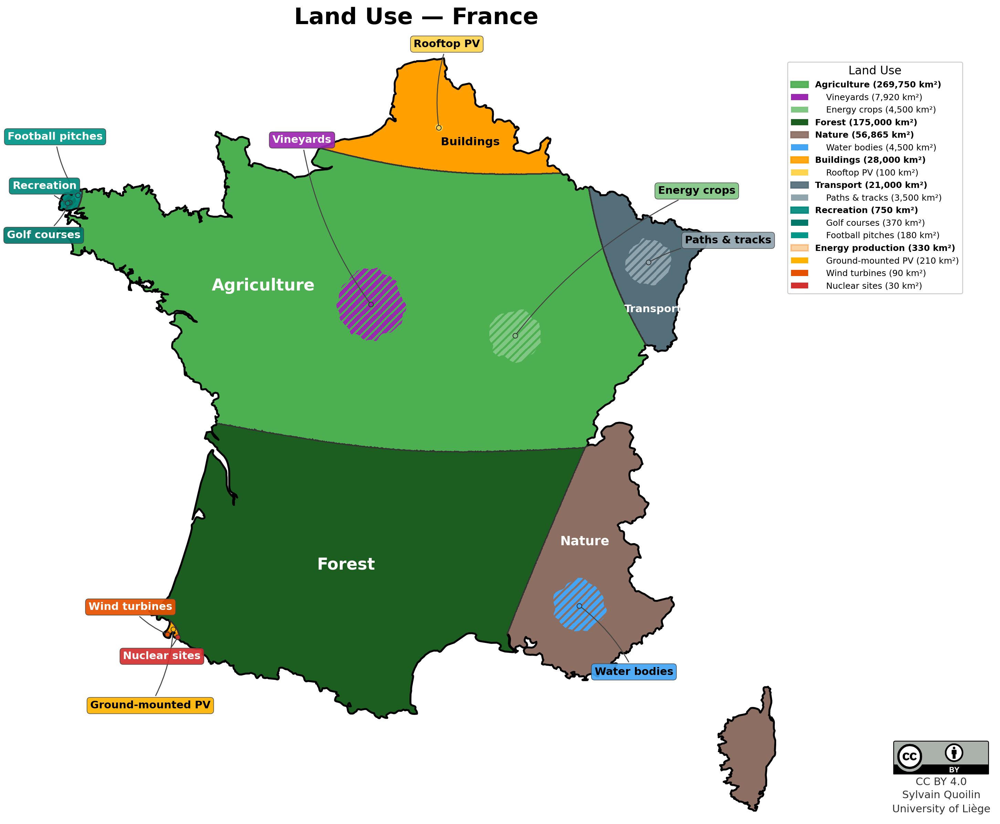

# France Land Use — Data Collection and Methodology

This document describes the data sources, methodology, and proposed category
breakdown for applying the land-use mapping framework to **metropolitan France**
(including Corsica, excluding overseas territories).

## Result

| Hierarchical (7 parents, 16 leaves) |
|---|
|  |

- **Runtime:** ~30 seconds (500 m grid, ~2.2 M cells)

> **Note:** France flat mode (15 categories) does not converge for the
> smallest categories due to extreme size ratios (257,000 km² vs 30 km²
> in a single allocation pass). The hierarchical mode solves this by
> splitting the allocation into two levels and is the recommended approach.

## Reference Area

Metropolitan France: **551,695 km²** (INSEE).

## Script Reusability

The existing `belgium_land_use_grid.py` is **fully generic** — all
country-specific information is passed as parameters. No code changes are
required to run it for France. The call is simply:

```python
main(csv_path="france_land_use.csv",
     boundary_file="france.geojson",
     country_name="France",
     output_prefix="france_land_use")
```

Or from the command line:

```bash
python belgium_land_use_grid.py france_land_use.csv
```

**What is shared (100 % of the script):**

| Component | Status |
|---|---|
| CSV loader (`load_categories`) | Generic — reads any CSV with `name, area_km2, color [, parent]` |
| Hierarchy builder (`build_hierarchy`) | Generic — builds parent/child from any CSV |
| Rasterizer (`load_and_rasterize`) | Generic — accepts any GeoJSON boundary |
| Seed placement, Voronoi, connectivity, border swap | Fully generic |
| Interior-island allocator (`allocate_interior_islands`) | Fully generic |
| Visualization, labels, legend, CC-BY | Parameterized by `country_name` |

**What is country-specific (data only, no code):**

| Item | Belgium | France |
|---|---|---|
| Boundary file | `belgium.geojson` | `france.geojson` (to create) |
| Category CSV | `belgium_land_use.csv` | `france_land_use.csv` (to create) |
| Hierarchical CSV | `belgium_land_use_hierarchical.csv` | `france_land_use_hierarchical.csv` (to create) |

### Performance note

France is ~18× larger than Belgium. At 500 m resolution the grid contains
~2.2 M pixels (vs 122 K for Belgium). The weighted Voronoi phase allocates a
`(n_cats, h, w)` float32 array (~240 MB for 15 categories) and iterates up to
400 times, so Level 1 may take 30–60 s instead of 2 s. If runtime is a
concern, increasing `RESOLUTION` to 1000 m (at the top of the script) reduces
pixel count to ~550 K and runtime to ~5–10 s, at the cost of coarser
boundaries.

## France-Specific Categories

Compared to Belgium, France introduces two categories that do not exist in the
Belgian CSV:

| New category | Rationale |
|---|---|
| **Vineyards** | 7,920 km² — a major land use (1.4 % of territory) with no Belgian equivalent |
| **Nuclear sites** | 30 km² — 19 power-plant sites; insignificant in Belgium |

Both are handled by simply adding rows to the CSV. **No script modifications
are needed.**

---

## Proposed Categories

### Flat mode (15 categories)

All categories are mutually exclusive and sum to **551,695 km²**.

| # | Category | Area (km²) | % of Total | Source / Method |
|---|---|---|---|---|
| 1 | Agricultural land (food & feed) | 257,330 | 46.6 % | SAU (~267,900 km², Agreste/Eurostat) minus vineyards and energy crops |
| 2 | Forest | 175,000 | 31.7 % | IGN National Forest Inventory: 17.5 M ha |
| 3 | Vineyards | 7,920 | 1.4 % | OIV 2023: 792,000 ha |
| 4 | Other natural/rest | 52,365 | 9.5 % | Residual to reach 100 % |
| 5 | Roads & rail | 17,500 | 3.2 % | Road network lengths × typical widths (see below) |
| 6 | Buildings | 28,000 | 5.1 % | Teruti-Lucas: built artificial surfaces (16,100 km²) + part of non-built |
| 7 | Energy crops | 4,500 | 0.8 % | Rapeseed, maize, wheat for biofuels (see below) |
| 8 | Paths/tracks | 3,500 | 0.6 % | Estimated from OSM track/path/cycleway lengths |
| 9 | Water bodies (inland) | 4,500 | 0.8 % | CLC + Teruti-Lucas wetlands/water |
| 10 | Golf courses | 370 | 0.07 % | FFG: ~735 courses × ~50 ha average |
| 11 | Football pitches | 180 | 0.03 % | FFF: ~30,000 pitches × 0.006 km² |
| 12 | Sport facilities (other) | 200 | 0.04 % | Estimate (tennis, athletics, swimming, etc.) |
| 13 | Wind turbines (footprint) | 90 | 0.02 % | ~22 GW onshore × 0.004 km²/MW |
| 14 | Ground-mounted solar PV | 210 | 0.04 % | ~14 GW ground-mounted × 1.5 ha/MW |
| 15 | Nuclear sites | 30 | < 0.01 % | 19 EDF sites × ~160 ha average |

### Hierarchical mode (8 parent sectors)

| Parent Sector (total area) | Sub-sector | Area (km²) |
|---|---|---|
| **Agriculture** (269,750 km²) | Vineyards | 7,920 |
| | Energy crops | 4,500 |
| **Forest** (175,000 km²) | — | — |
| **Nature** (56,865 km²) | Water bodies | 4,500 |
| **Built-up** (28,000 km²) | Rooftop PV | 100 |
| **Transport** (21,000 km²) | Paths & tracks | 3,500 |
| **Recreation** (750 km²) | Golf courses | 370 |
| | Football pitches | 180 |
| **Energy production** (330 km²) | Ground-mounted PV | 210 |
| | Wind turbines | 90 |
| | Nuclear sites | 30 |

Parent totals sum to 551,695 km². Sub-sector areas are carved out of their
parent; the parent's colour remains visible as background.

---

## Detailed Source Notes

### 1. Agriculture and Energy Crops

**Total agricultural area (SAU)**

France's SAU is approximately **26.7–27.4 million hectares** (~267,000–274,000
km²), representing about 49 % of metropolitan territory. This makes France the
largest agricultural country in the EU.

*Sources:* Agreste (Statistique Agricole Annuelle 2022), Eurostat
(27.4 M ha in 2020).

The SAU is composed of:
- **Arable land:** ~18.3 M ha (cereals, oilseeds, protein crops, root crops,
  fodder, fallow)
- **Permanent grassland:** ~8.2 M ha (pastures, alpine meadows)
- **Permanent crops:** ~1.0 M ha (vineyards, orchards, nurseries)

**Vineyards (~7,920 km²)**

France is the world's second-largest wine-growing country. The OIV (2023)
reports 792,000 ha of vineyards. Major regions include Languedoc-Roussillon,
Bordeaux, Champagne, Burgundy, and the Rhône Valley. Vineyards are a
significant and distinctive land use that warrants a dedicated category.

*Sources:* OIV (Organisation Internationale de la Vigne et du Vin) 2023,
FranceAgriMer.

**Energy crops (~4,500 km²)**

France produces significant volumes of biofuels. The dedicated energy-crop
area is estimated at ~4,500 km² after co-product allocation:

- **Rapeseed for biodiesel (~2,000 km²):** France grows ~1.35 M ha of
  rapeseed (Agreste 2023). However, rapeseed yields both oil (biodiesel) and
  meal (animal feed). Applying a ~60 % energy allocation to the oil fraction
  and estimating that ~25 % of French rapeseed goes to domestic biodiesel
  gives: 1,350,000 ha × 25 % × 60 % ≈ 200,000 ha ≈ 2,000 km².

- **Maize and wheat for bioethanol (~2,000 km²):** France has several
  bioethanol plants, including Tereos (Origny, Lillers), Cristal Union
  (Bazancourt), and others. Total French bioethanol production is ~15 M
  hectoliters/year. With average yields of ~70 hL/ha for wheat-based ethanol
  (after allocation), this implies ~2,000 km² of dedicated cropland.

- **Maize for biogas (~500 km²):** France has ~1,200 biogas plants (AAMF
  2023). Energy crops represent a modest fraction of inputs (~10–15 %,
  remainder being manure, crop residues, and food waste). Estimated at
  ~50,000 ha.

*Sources:* Agreste, SNPAA (Syndicat National des Producteurs d'Alcool
Agricole), AAMF (Association des Agriculteurs Méthaniseurs de France),
EU Court of Auditors SR-2023-29 on biofuels.

**Agricultural land (food & feed) — 257,330 km²**

This is the remainder of the SAU after subtracting vineyards and energy crops.
It covers cereals, oilseeds for food, protein crops, root crops (sugar beet,
potatoes), fodder, permanent grassland, orchards, and fallow.

### 2. Forest

**Forest (~175,000 km²)**

The IGN National Forest Inventory (Inventaire Forestier National, results
2024 based on 2019–2023 measurements) reports **17.5 million hectares** of
forest in metropolitan France, representing **32 % of the territory**. Forest
area continues to expand at ~90,000 ha/year, mainly through natural
recolonisation of abandoned agricultural land.

Composition (approximate):
- Broadleaf: ~10.0 M ha (oak, beech, chestnut, etc.)
- Coniferous: ~5.0 M ha (maritime pine, spruce, Douglas fir, etc.)
- Mixed: ~2.5 M ha

*Sources:* IGN (Mémento de l'inventaire forestier 2024), ONF.

### 3. Built-up and Artificial Areas

**Buildings (~28,000 km²)**

Teruti-Lucas (2021) reports **16,100 km²** of "bâti" (built-up) artificial
surfaces (residential, commercial, industrial buildings). The remaining
**18,900 km²** of "non-bâti" (non-built) artificial surfaces include roads,
parking lots, construction sites, urban green spaces, and sport facilities.
We allocate approximately 12,000 km² of the non-built total to Buildings
(parking, gardens, yards, construction sites) and assign the rest to Transport
and Recreation.

*Sources:* Teruti-Lucas 2021 (Agreste/SSP), INSEE.

**Rooftop PV (~100 km²)**

France had ~30.5 GW DC of total solar PV capacity at end 2024 (IEA PVPS),
of which ~16.6 GW was decentralized (rooftop). At ~6 m²/kWp panel footprint:
16,600 MW × 6 m²/kWp = ~100 km² of rooftop panel area.

*Sources:* IEA PVPS France NSR 2024, RTE Bilan électrique 2024.

### 4. Transport

**Roads & rail (~17,500 km²)**

France has one of Europe's densest road networks: **~1,109,000 km** total
(INSEE 2023), composed of:

| Road type | Length (km) | Typical width (m) | Area (km²) |
|---|---|---|---|
| Autoroutes | 12,400 | 60 (incl. median, shoulders) | ~740 |
| Routes nationales | 11,200 | 25 | ~280 |
| Routes départementales | 381,300 | 12 | ~4,580 |
| Routes communales | 704,900 | 8 | ~5,640 |
| **Roads subtotal** | **1,109,800** | | **~11,240** |
| Railways | 27,000 | 15 | ~400 |
| Airports, ports, etc. | — | — | ~500 |
| **Transport total** | | | **~12,140** |

Note: the "typical width" includes the full right-of-way (emprise), not just
pavement. However, Teruti-Lucas categorises all transport infrastructure
(roads, parking, ports, airports) under "non-built artificial" (~18,900 km²
total). Our 17,500 km² estimate for Transport is within the non-built budget,
leaving room for parking, urban green, and sport facilities.

*Sources:* INSEE (réseau routier 2023), SNCF Réseau, CLC 2018.

**Paths & tracks (~3,500 km²)**

Estimated from OpenStreetMap data. France has an extensive network of rural
tracks, footpaths, and cycleways. OSM maps ~300,000 km of tracks, ~150,000 km
of paths, ~100,000 km of footways, and ~50,000 km of cycleways. Multiplying
by typical widths (2.5 m for tracks, 1.5 m for others) gives ~3,500 km².

### 5. Natural Areas and Water Bodies

**Other natural/rest (~52,365 km²)**

This is the balancing residual. It absorbs:
- Heathland, moors, maquis, garrigue: ~19,700 km² (Teruti-Lucas)
- Bare rock, sand, beaches: ~1,600 km²
- Transitional woodland-shrub
- Wetlands (marshes, peat bogs) not in water bodies
- Any land not captured by other categories

**Water bodies (~4,500 km²)**

Inland water surfaces including rivers, lakes, canals, and reservoirs.
Teruti-Lucas reports ~7,400 km² for "wetlands + water" combined; the strict
open-water surface is estimated at ~4,500 km² based on CLC categories 511
(water courses) and 512 (water bodies).

*Sources:* CLC 2018, Teruti-Lucas 2021.

### 6. Sports and Leisure

**Golf courses (~370 km²)**

The Fédération Française de Golf (FFG) counts **~735 golf facilities** with
actual terrain, of which 611 are 9-hole or larger. An average golf course
occupies ~50 ha total. Of this, ~50 % is maintained playing area (tees,
fairways, greens), with the rest being clubhouse, parking, and rough natural
zones. Total: 735 × 50 ha = ~36,750 ha ≈ **370 km²**.

*Sources:* FFG (Fédération Française de Golf), GSP H24 panorama 2024.

**Football pitches (~180 km²)**

The Fédération Française de Football (FFF) registers over **30,000 pitches**
across France. Using the same per-pitch area as Belgium (0.006 km², covering
pitch, surrounds, and parking): 30,000 × 0.006 = **180 km²**.

*Sources:* FFF, CNOSF (Comité National Olympique et Sportif Français).

**Sport facilities, other (~200 km²)**

Rough estimate for tennis courts (~30,000 clubs), swimming pools, athletics
tracks, equestrian centres, and other facilities not covered by golf or
football.

### 7. Energy Production

**Ground-mounted solar PV (~210 km²)**

France had ~30.5 GW DC of cumulative solar PV at end 2024. Of this, ~13.8 GW
was centralized (ground-mounted, utility-scale). At the industry standard of
1.5 ha/MW: 13,800 MW × 1.5 ha/MW = 20,700 ha ≈ **210 km²**.

France has been adding ~2 GW of ground-mounted PV per year, with major solar
parks including Cestas (300 MW, 2.5 km²) and several large sites in
Nouvelle-Aquitaine and Occitanie.

*Sources:* IEA PVPS France NSR 2024, RTE, CRE (Commission de Régulation de
l'Énergie).

**Wind turbines (~90 km²)**

France has ~22 GW of onshore wind capacity (RTE 2024), with ~10,000
turbines. Direct footprint (foundations, access roads, substations) is
estimated at 0.004 km²/MW: 22,000 MW × 0.004 = **~90 km²**. The total
"wind farm area" is much larger but most land remains in agricultural use.

*Sources:* RTE (Bilan électrique 2024), WindEurope, FEE (France Énergie
Éolienne).

**Nuclear sites (~30 km²)**

EDF operates **57 reactors across 19 nuclear power plant sites** in
metropolitan France (62.9 GW installed). Typical site area is 100–200 ha
(including cooling towers, switchyards, buffer zones, and reservoirs).
19 sites × ~160 ha average = ~3,000 ha ≈ **30 km²**.

Major sites include Gravelines (6 × 900 MW), Cattenom (4 × 1,300 MW),
Paluel (4 × 1,300 MW), and the under-construction Flamanville EPR.

*Sources:* EDF (opendata.edf.fr), ASN (Autorité de Sûreté Nucléaire).

---

## Colour Scheme Proposal

### Flat mode

| Category | Hex | Notes |
|---|---|---|
| Agricultural land | `#4CAF50` | Medium green (same family as Belgium) |
| Forest | `#1B5E20` | Dark green |
| Vineyards | `#7B1FA2` | Purple (grape colour) |
| Other natural/rest | `#8D6E63` | Brown |
| Roads & rail | `#616161` | Dark grey |
| Buildings | `#E8B54D` | Amber |
| Energy crops | `#558B2F` | Olive green |
| Paths/tracks | `#BCAAA4` | Light brown |
| Water bodies | `#1565C0` | Blue |
| Golf courses | `#00897B` | Teal |
| Football pitches | `#00ACC1` | Cyan |
| Sport facilities | `#26C6DA` | Light cyan |
| Wind turbines | `#EF6C00` | Deep orange |
| Ground-mounted solar PV | `#FDD835` | Yellow |
| Nuclear sites | `#D32F2F` | Red (distinctive for nuclear) |

### Hierarchical mode

| Category | Hex | Parent |
|---|---|---|
| Agriculture | `#4CAF50` | — |
| Vineyards | `#9C27B0` | Agriculture |
| Energy crops | `#81C784` | Agriculture |
| Forest | `#1B5E20` | — |
| Nature | `#8D6E63` | — |
| Water bodies | `#42A5F5` | Nature |
| Built-up | `#FFA000` | — |
| Rooftop PV | `#FFD54F` | Built-up |
| Transport | `#546E7A` | — |
| Paths & tracks | `#90A4AE` | Transport |
| Recreation | `#00897B` | — |
| Golf courses | `#00796B` | Recreation |
| Football pitches | `#009688` | Recreation |
| Energy production | `#F57C00` | — |
| Ground-mounted PV | `#FFB300` | Energy production |
| Wind turbines | `#E65100` | Energy production |
| Nuclear sites | `#D32F2F` | Energy production |

---

## Files To Create

1. **`france.geojson`** — Metropolitan France boundary in EPSG:4326.
   Can be obtained from Natural Earth (1:10m admin-0 countries), GADM, or
   IGN Admin Express.

2. **`france_land_use.csv`** — Flat category data (15 rows).

3. **`france_land_use_hierarchical.csv`** — Hierarchical category data
   (17 rows: 8 parents + 9 sub-sectors).

## Data Sources

- **Agreste** (Ministry of Agriculture statistics) — SAU, crop areas.
  https://agreste.agriculture.gouv.fr/
- **INSEE** — territory, population, road network.
  https://www.insee.fr/
- **IGN** — forest inventory, administrative boundaries.
  https://inventaire-forestier.ign.fr/
- **Teruti-Lucas** (Agreste/SSP) — land occupation survey.
  https://agreste.agriculture.gouv.fr/agreste-web/disaron/W0021/detail/
- **Eurostat** — agricultural area, energy statistics.
  https://ec.europa.eu/eurostat/
- **OIV** — vineyard statistics.
  https://www.oiv.int/
- **FranceAgriMer** — wine sector data.
  https://www.franceagrimer.fr/
- **RTE** — electricity system, renewable capacity.
  https://www.rte-france.com/
- **IEA PVPS** — solar PV country reports.
  https://iea-pvps.org/
- **EDF** — nuclear fleet data.
  https://opendata.edf.fr/
- **FFG** — Fédération Française de Golf.
  https://www.ffgolf.org/
- **FFF** — Fédération Française de Football.
  https://www.fff.fr/
- **OpenStreetMap** — paths, tracks, cycleways.
  https://www.openstreetmap.org/
- **CLC 2018** — Corine Land Cover.
  https://land.copernicus.eu/en/products/corine-land-cover
- **WindEurope** — wind capacity statistics.
  https://windeurope.org/
